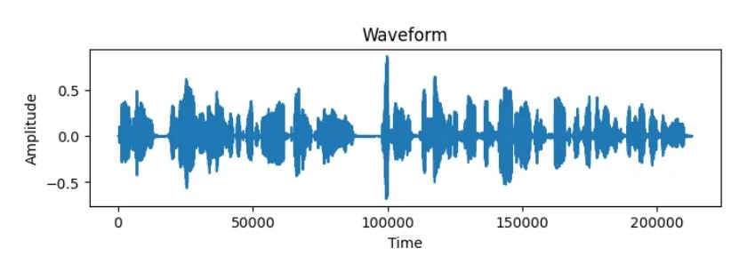
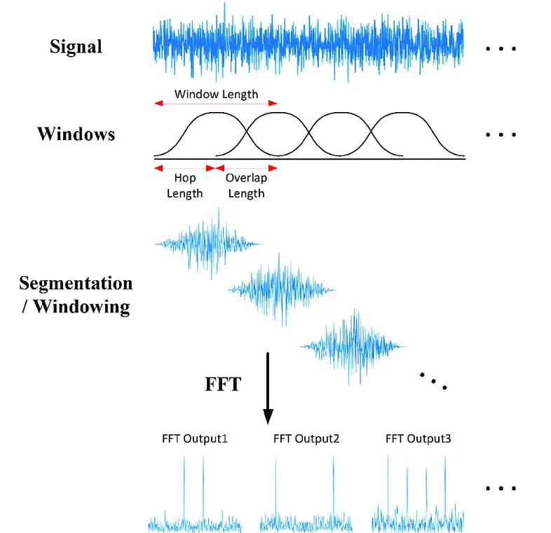
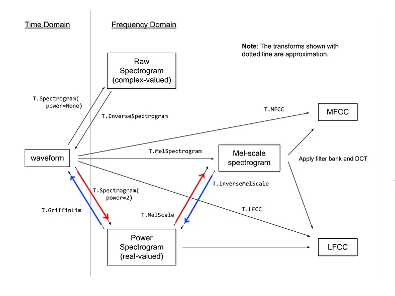
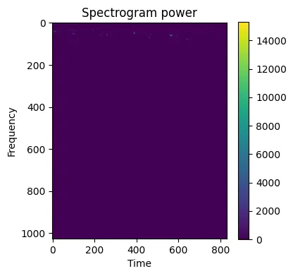
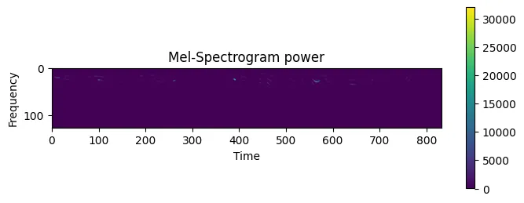
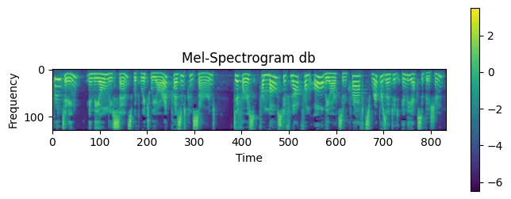
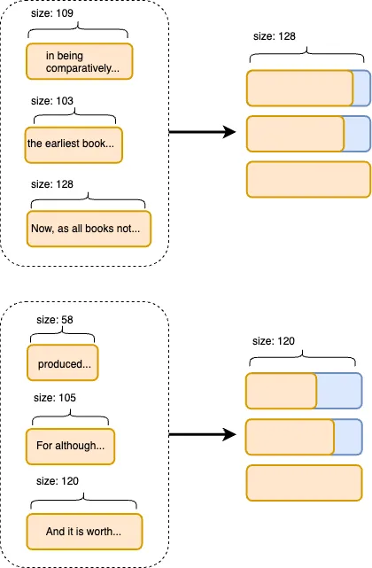
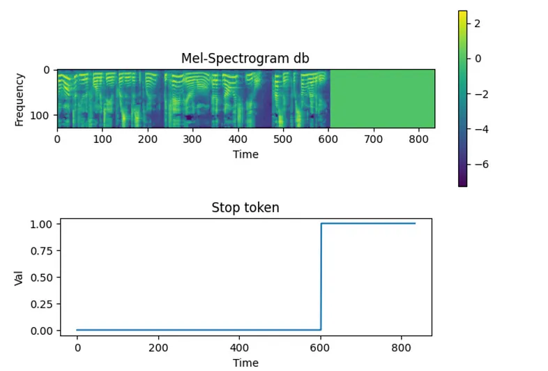
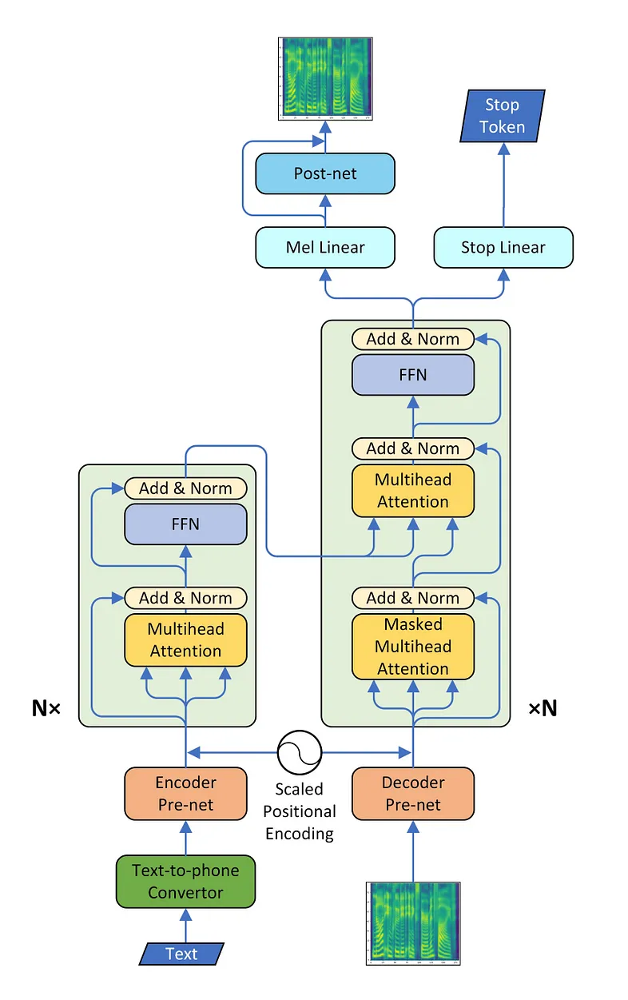

# Build text-to-speech from scratch

## [Build text-to-speech from scratch](https://medium.com/@tttzof351/build-text-to-speech-from-scratch-part-1-ba8b313a504f)

## Text Transformation

* Use letters — the most obvious way, 가이드에서는 이 방법을 사용한다.

* Use Phonemes -> 나중에 해볼 기회가 생길지도...

```python
# Alphabet
  symbols = [
    'EOS', ' ', '!', ',', '-', '.', \
    ';', '?', 'a', 'b', 'c', 'd', 'e', 'f', \
    'g', 'h', 'i', 'j', 'k', 'l', 'm', 'n', 'o', 'p', 'q', \
    'r', 's', 't', 'u', 'v', 'w', 'x', 'y', 'z', 'à', \
    'â', 'è', 'é', 'ê', 'ü', '’', '“', '”' \
  ]
```

- 위 리스트를 기반으로 딕셔너리 생성

```python
import torch
from hyperparams import hp

symbol_to_id = {
    s: i for i, s in enumerate(hp.symbols) # 바로 위의 symbols
}

def text_to_seq(text):
    text = text.lower() # symbol에 대문자가 포함되어 있지 않음
    seq = []
    for s in text:
        _id = symbol_to_id.get(s, None)
        # dict.get()은 키 s에 해당하는 value를 반환하는데
        # 값이 없다면 None을 반환합니다.
        if _id is not None:
            # None이 아니라면, 리스트에 value를 추가합니다.
            seq.append(_id)

    seq.append(symbol_to_id["EOS"])
    return torch.IntTensor(seq)

# IN
print(text_to_seq("Hello, World"))
```

```python
# OUT
tensor([15, 12, 19, 19, 22,  3,  1, 30, 22, 25, 19, 11,  0], dtype=torch.int32)
```

## Audio Transformation

- TTS 모델 구축을 위한 데이터 전처리의 핵심. **오디오는 시간에 따른 진폭의 종속적인 패턴이다.**

```python
# load wav
wav_path = f"{hp.wav_path}/LJ001-0001.wav"
wavform, sample_rate = torchaudio.load(wav_path, normalize=True)

# plot wav
_ = plt.figure(figsize=(8, 2))
_ = plt.title("Waveform")
_ = plt.plot(waveform.squeeze(0).detach().cpu().numpy())
_ = plt.xlabel("Time")
_ = plt.ylabel("Amplitude")
```

- 신호의 파형을 나타내는 그래프, 가로축 Time과 세로축 Amplitude로 구성되어 있다. 시간 영역에서 분석된 결과로 이해할 수 있다.



### 단시간 푸리에 변환

**NOTE** 푸리에 변환에 대해 조금 더 알아볼 필요가 있다.

- 푸리에 변환을 통해 위의 파형에서 주파수(Frequency)를 분석할 수 있다. 주파수는 신호가 얼마나 빠르게 반복되는지를 나타내며, 단위는 헤르츠(Hz)이다.

- 푸리에 변환은 신호를 여러 개의 사인파로 분해한다. 각 사인파는 특정한 주파수, 진폭, 위상을 가지고 있다. 결과적으로, 푸리에 변환은 신호를 주파수 대역에서의 강도로 나타낸다.

- 단시간 푸리에 변환은 시간 창(window)을 만들어, 각 구간에 대해 FFT를 수행한다. 이를 통해 시간에 따라 주파수 성분이 어떻게 변화하는지 분석한다. 결과는 스펙트로그램(Spectrogram)으로 나타내며, 시간-주파수의 분포를 시각화할 수 있다.

```
정리:
- Time: 신호가 시간에 따라 어떻게 변하는지 보여줌.
- Amplitude: 신호의 크기(진폭) 변화를 나타냄.
- Frequency: 푸리에 변환을 통해 신호가 어떤 주파수 성분으로 이루어졌는지 분석.

푸리에 변환의 실제 적용:
위 파형의 경우:

FFT를 수행하면 신호 전체에 포함된 주요 주파수 성분을 파악할 수 있다.
예를 들어, 음성 신호라면 주요 음조와 배음(Harmonics)을 분석.

STFT를 수행하면 시간에 따라 변화하는 주파수 성분(예: 음절, 단어)이 드러나게 된다.

예: 특정 구간에서 높은 주파수 성분이 나타나는지, 
혹은 특정 주파수 대역이 어떻게 시간이 지남에 따라 변화하는지 분석.

```

#### **Power란**
- Power는 신호의 에너지(Amplitude의 제곱)에 비례하며, 특정 주파수 대역에서 신호가 얼마나 강한지(얼마나 많은 에너지를 가지는지)를 나타낸다. 예를 들어, 음악에서 특정 음이 클수록 해당 음에 해당하는 주파수의 Power가 크다.

- STFT 결과를 시각화한 스펙트로그램에서는 Power를 색상으로 표시한다. 주파수-시간 축에서 Power가 높은 영역은 더 밝거나 짙은 색으로 나타낸다.

- STFT 개괄



### MEL Scale

- 인간의 가청 주파수에 한계가 있기 때문에, 신호의 차원을 줄일 필요가 있다. 이때 Mel-scale transformation이 필요하다.

### Griffin-Lim 알고리즘

- 스펙트로그램의 진폭 정보로부터 음향 신호를 생성한다.

## Audio Transformations Code

- (torchaudio.transforms.Spectrogram)[https://pytorch.org/audio/stable/generated/torchaudio.transforms.Spectrogram.html#torchaudio.transforms.Spectrogram] -> wrap around STFT

- (torchaudio.transforms.MelScale)[https://pytorch.org/audio/stable/generated/torchaudio.transforms.MelScale.html#torchaudio.transforms.MelScale] -> convert normal STFT into a mel frequency STFT



- 가이드에서는 전처리 과정을 빨간색 화살표로, 추론 과정은 파란색 화살표로 나타내었다.

#### torchaudio.transforms.Spectrogram() 사용 예시

```python
# melspecs.py
from hyperparams import hp
import torch
import torchaudio
from torchaudio.functional import spectrogram


spec_transform = torchaudio.transforms.Spectrogram(
    n_fft=hp.n_fft, 
    win_length=hp.win_length,
    hop_length=hp.hop_length,
    power=hp.power
)

...

# example.py
from melspec import spec_transform

# wav -> spectrogram-power
# waveform으로 torchaudio.transforms.Spectrogram의 인스턴스 생성
spec = spec_transform(waveform)

# Plot spectrogram-power
fig, (ax1) = plt.subplots(figsize=(4, 4), ncols=1)

_ = ax1.set_title("Spectrogram power")
pos = ax1.imshow(spec.squeeze(0).detach().cpu().numpy())
_ = fig.colorbar(pos, ax=ax1)

_ = ax1.set_xlabel("Time")
_ = ax1.set_ylabel("Frequency")

```



- 데이터가 눈에 잘 보이지 않는다. 그래프가 이런 식이면 학습할 때 각 데이터의 특징이 잘 반영되지 않을 것이다. 게다가, 낮은 주파수 이외의 거의 대부분의 영역이 비어있다는 것을 확인할 수 있다.

#### torchaudio.transforms.Melscale() 사용 예시

```python
# melspecs.py
from hyperparams import hp
import torch
import torchaudio
from torchaudio.functional import spectrogram


mel_scale_transform = torchaudio.transforms.MelScale(
  n_mels=hp.mel_freq, 
  sample_rate=hp.sr, 
  n_stft=hp.n_stft
)

...

# example.py

from melspecs import spec_transform

# wav -> spectrogram-power
spec = spec_transform(waveform)

# Plot spectrogram-power
fig, (ax1) = plt.subplots(figsize=(4, 4), ncols=1)

_ = ax1.set_title("Spectrogram power")
pos = ax1.imshow(spec.squeeze(0).detach().cpu().numpy())
_ = fig.colorbar(pos, ax=ax1)

_ = ax1.set_xlabel("Time")
_ = ax1.set_ylabel("Frequency")
```



- 차원을 줄였지만, 여전히 가시성이 떨어진다. 주파수 간의 차이가 크지 않기 때문인데, 좀더 확인하기 쉽게 만들기 위해 데시벨로의 전환이 필요하다.

#### torchaudio.functional.amplitude_to_DB () 사용 예시

```python
# melspecs.py
from hyperparams import hp
import torch
import torchaudio
from torchaudio.functional import spectrogram


def pow_to_db_mel_spec(mel_spec):
  mel_spec = torchaudio.functional.amplitude_to_DB(
    mel_spec,
    multiplier = hp.ampl_multiplier, 
    amin = hp.ampl_amin, 
    db_multiplier = hp.db_multiplier, 
    top_db = hp.max_db
  )
  mel_spec = mel_spec/hp.scale_db
  return mel_spec

...

# example.py
from melspecs import pow_to_db_mel_spec

# mel-spectrogram-power to mel-spectrogram-db
db_mel_spec = pow_to_db_mel_spec(mel_spec)

# Plot mel-spectrogram-db
fig, (ax1) = plt.subplots(figsize=(8, 3), ncols=1)

_ = ax1.set_title("Mel-Spectrogram db")
pos = ax1.imshow(db_mel_spec.squeeze(0).detach().cpu().numpy())
_ = fig.colorbar(pos, ax=ax1)

_ = ax1.set_xlabel("Time")
_ = ax1.set_ylabel("Frequency")
```



#### 최종적으로 ...

```python
def convert_to_mel_spec(wav):
  spec = spec_transform(wav)
  mel_spec = mel_scale_transform(spec)
  db_mel_spec = pow_to_db_mel_spec(mel_spec)
  db_mel_spec = db_mel_spec.squeeze(0)
  return db_mel_spec
```

- 이런식의 구조를 가지면 편할 듯 하다.

#### Reverse Transformation으로 원본 음성과 비교하기

- 가이드에서는 `inverse_mel_spec_to_wav`를 통해 진행하는데, 이것또한 TorchAudio의 기능이다.

```python
# melspecs.py
from hyperparams import hp
import torch
import torchaudio
from torchaudio.functional import spectrogram

def db_to_power_mel_spec(mel_spec):
  mel_spec = mel_spec*hp.scale_db
  mel_spec = torchaudio.functional.DB_to_amplitude(
    mel_spec,
    ref=hp.ampl_ref,
    power=hp.ampl_power
  )  
  return mel_spec

mel_inverse_transform = torchaudio.transforms.InverseMelScale(
  n_mels=hp.mel_freq, 
  sample_rate=hp.sr, 
  n_stft=hp.n_stft
).cuda()

griffnlim_transform = torchaudio.transforms.GriffinLim(
    n_fft=hp.n_fft,
    win_length=hp.win_length,
    hop_length=hp.hop_length
).cuda()

def inverse_mel_spec_to_wav(mel_spec):
  power_mel_spec = db_to_power_mel_spec(mel_spec)
  spectrogram = mel_inverse_transform(power_mel_spec)
  pseudo_wav = griffnlim_transform(spectrogram)
  return pseudo_wav

...

# example.py
from melspecs import inverse_mel_spec_to_wav

# mel-spec-db -> waveform
pseudo_wav = inverse_mel_spec_to_wav(db_mel_spec.cuda())

IPython.display.Audio(
    pseudo_wav.detach().cpu().numpy(),
    rate=hp.sr
)
```

- 변환해서 들어보면 잡음이 아주 조금 섞인거 빼고는 거의 똑같다는 것을 확인할 수 있다. **AutoEncoder**로 이미지를 특성 벡터로 차원을 줄였다가 늘렸던 기억이 난다. 그것과 비슷한 것 같다.


## Dataset/Dataloader

- gpt의 도움도 받아가면서 작성하다 보니, 가이드의 데이터셋과 내가 만들어 본 데이터셋이 완전히 똑같지는 않았다. 가이드 기준으로 작성한다.

```python
class TextMelDataset(torch.utils.data.Dataset):
    ...

    def get_item(self, row):
      wav_id = row["wav"]                  
      wav_path = f"{hp.wav_path}/{wav_id}.wav"

      text = row["text_norm"]
      text = text_to_seq(text)

      waveform, sample_rate = torchaudio.load(wav_path, normalize=True)
      assert sample_rate == hp.sr

      mel = convert_to_mel_spec(waveform)

      return (text, mel)
    
    ...
```



- 문장의 길이가 제각각일텐데, 여러 문장을 하나의 배치로 진행하기 위해서는 오디오의 길이를 조정해 줄 필요가 있다. `text_max_length`를 정하고 텍스트의 길이가 max_length보다 길다면 자르고, 짧으면 패딩을 해줘야 한다.

```python
def text_mel_collate_fn(batch):
  # Find max len of text in batch
  text_length_max = torch.tensor(
    [text.shape[-1] for text, _ in batch], 
    dtype=torch.int32
  ).max()

  # Find max len of mel spec in batch
  mel_length_max = torch.tensor(
    [mel.shape[-1] for _, mel in batch],
    dtype=torch.int32
  ).max()

  
  text_lengths = []
  mel_lengths = []
  texts_padded = []
  mels_padded = []

  for text, mel in batch:
    text_length = text.shape[-1]      
    
    # Alignment text with max text
    text_padded = torch.nn.functional.pad(
      text,
      pad=[0, text_length_max-text_length],
      value=0
    )

    mel_length = mel.shape[-1]

    # Alignment mel-spec with max mel-spec
    mel_padded = torch.nn.functional.pad(
        mel,
        pad=[0, mel_length_max-mel_length],
        value=0
    )
    
    # Keep original text lens
    text_lengths.append(text_length)    
    
    # Keep original mel-spec lens
    mel_lengths.append(mel_length)    

    # Keep alignmented text 
    texts_padded.append(text_padded)    

    # Keep alignmented mel-specs
    mels_padded.append(mel_padded)

  text_lengths = torch.tensor(text_lengths, dtype=torch.int32)
  mel_lengths = torch.tensor(mel_lengths, dtype=torch.int32)
  texts_padded = torch.stack(texts_padded, 0)
  mels_padded = torch.stack(mels_padded, 0).transpose(1, 2)
  
  # New element - STOP token
  # Needed to learn when to stop generating audio.
  gate_padded = mask_from_seq_lengths(
      mel_lengths,
      mel_length_max
  )
  gate_padded = (~gate_padded).float()
  gate_padded[:, -1] = 1.0
  
  return texts_padded, \
         text_lengths, \
         mels_padded, \
         gate_padded, \
         mel_lengths
```

### 배치 구조


```python
# IN
df = pd.read_csv(hp.csv_path)
dataset = TextMelDataset(df)

train_loader = torch.utils.data.DataLoader(
    dataset, 
    num_workers=2, 
    shuffle=True,
    sampler=None, 
    batch_size=hp.batch_size,
    pin_memory=True, 
    drop_last=True, 
    collate_fn=text_mel_collate_fn
)

def names_shape(names, shape):  
  assert len(names) == len(shape)
  return "(" + ", ".join([f"{k}={v}" for k, v in list(zip(names, shape))]) + ")"

for i, batch in enumerate(train_loader):
  text_padded, \
  text_lengths, \
  mel_padded, \
  mel_lengths, \
  stop_token_padded = batch

  print(f"=========batch {i}=========")
  print("text_padded:", names_shape(["N", "S"], text_padded.shape))
  print("text_lengths:", names_shape(["N"], text_lengths.shape))
  print("mel_padded:", names_shape(["N", "TIME", "FREQ"], mel_padded.shape))
  print("mel_lengths:", names_shape(["N"], mel_lengths.shape))
  print("stop_token_padded:", names_shape(["N", "TIME"], stop_token_padded.shape))

  if i > 0:
    break
```

```python
# OUT
=========batch 0=========
text_padded: (N=32, S=152)
text_lengths: (N=32)
mel_padded: (N=32, TIME=841, FREQ=128)
mel_lengths: (N=32)
stop_token_padded: (N=32, TIME=841)
=========batch 1=========
text_padded: (N=32, S=153)
text_lengths: (N=32)
mel_padded: (N=32, TIME=864, FREQ=128)
mel_lengths: (N=32)
stop_token_padded: (N=32, TIME=864)
```

### Stop Token

#### 역할
- 스탑 토큰은 오토레그레시브(Autoregressive) 방식의 생성 모델에서 출력을 멈추는 기준을 제공하기 위해 사용된다.

(1) AutoRegressive Model (자기회귀모델) : 이전 단계의 출력을 입력으로 사용해 다음 출력을 생성하는 모델. 예를 들어, 음성 합성(TTS) 모델에서 한 프레임씩 오디오 신호를 생성한다. 이러한 모델은 언제 출력을 멈춰야 할지 명확한 기준이 없기 때문에, 스탑 토큰을 통해 "멈춤 시점"을 학습한다.

#### 구성
- 스탑 토큰은 생성된 오디오 신호의 시간 프레임에 따라 0과 1로 구성된 텐서이다:

- 0 (신호 포함): 오디오 신호가 유효한 정보를 포함하고 있는 구간.

- 1 (멈춤): 오디오 신호가 끝났음을 나타내는 구간.

예를 들어:

```python
tensor([0., 0., 0., ..., 1., 1., 1.])
```

- 앞부분(0.0): 모델이 오디오를 계속 생성해야 하는 구간.
- 뒷부분(1.0): 모델이 생성을 멈춰야 하는 구간.

- 훈련 과정에서, 모델의 추가적인 목표로 포함된다. 오디오 신호와 함께 스탑 토큰을 생성하도록 학습하며, 실제 값과 예측 값 간의 차이를 줄이도록 설계된다.



## 모델



- 트랜스포머 구조를 사용한 모델의 구조인데, 나는 간단한 GRU만을 사용했기 때문에 추가적인 공부가 필요하다.


